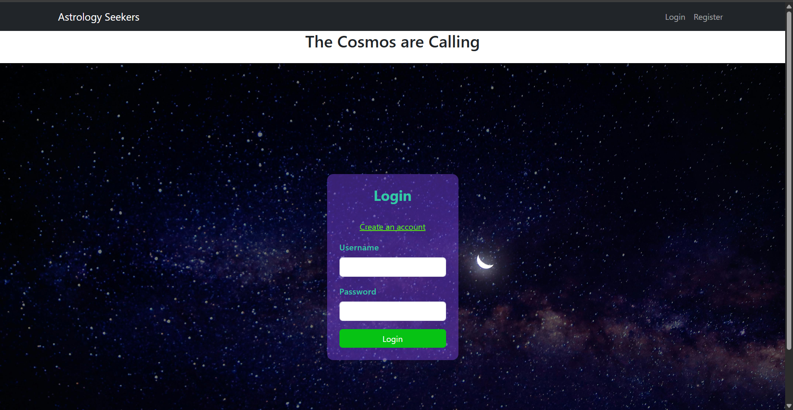
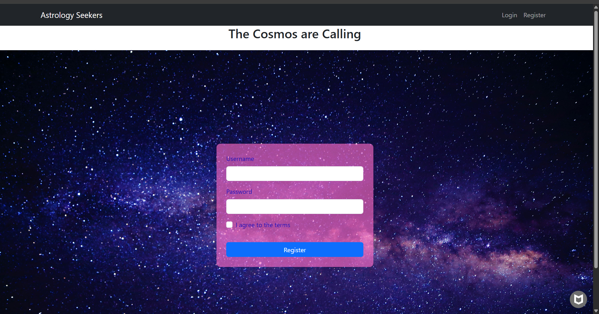
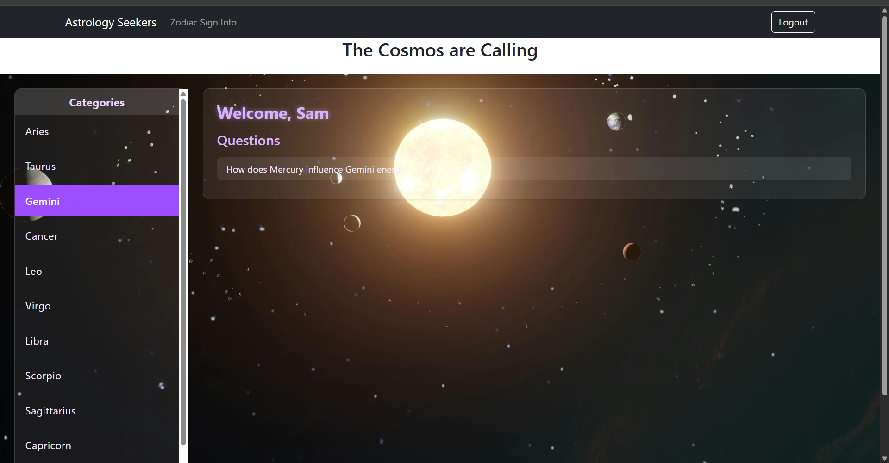

#  Nodejs Express

//  3-Tier architecture that lets users register and log in to a forum, where users may ask and answer questions.

## Astrological Signs Q & A 

// I made a simple base of questions for each sign. Although , A user can ask a question, they may only recieve a *no answer for this question responce

## User Features

1. Register a new account  
2. Log in with existing credentials  
3. View foundational information about each zodiac sign  
4. Ask a question about any sign  
5. Log out  

> Note: At this stage, user-submitted questions return a default  
> **“No answer for this question”** response unless seeded in the database.

# Client side 

* React
*  React Router v6
*  Bootstrap
*  GitHub Pages 

# Server side 

*  Node.js
*  Express.js
*  MySQL
*  bcrypt for passwoord hashing
*  Runs locally on localhost:4000

# Database schema 

CREATE DATABASE IF NOT EXISTS astro_qa;
USE astro_qa;

CREATE TABLE users (
  id INT AUTO_INCREMENT PRIMARY KEY,
  username VARCHAR(50) NOT NULL UNIQUE,
  password VARCHAR(255) NOT NULL,
  created_at TIMESTAMP DEFAULT CURRENT_TIMESTAMP
);

CREATE TABLE categories (
  id INT AUTO_INCREMENT PRIMARY KEY,
  name VARCHAR(100) NOT NULL,
  description TEXT
);

CREATE TABLE questions (
  id INT AUTO_INCREMENT PRIMARY KEY,
  user_id INT NOT NULL,
  category_id INT NOT NULL,
  question_text TEXT NOT NULL,
  created_at TIMESTAMP DEFAULT CURRENT_TIMESTAMP,
  FOREIGN KEY (user_id) REFERENCES users(id) ON DELETE CASCADE,
  FOREIGN KEY (category_id) REFERENCES categories(id) ON DELETE CASCADE
);

CREATE TABLE answers (
  id INT AUTO_INCREMENT PRIMARY KEY,
  question_id INT NOT NULL,
  user_id INT NOT NULL,
  answer_text TEXT NOT NULL,
  created_at TIMESTAMP DEFAULT CURRENT_TIMESTAMP,
  FOREIGN KEY (question_id) REFERENCES questions(id) ON DELETE CASCADE,
  FOREIGN KEY (user_id) REFERENCES users(id) ON DELETE CASCADE
);

# Database Variables

//   I have included .env.example in the server side to allow           everything to run locally 

//    dbConnections.js

    host: "localhost",
    user: "root",
    password: "Twilamae@16",
    database: "astro_qa",

# Frontend runs at 

//  http://localhost:3000

# Frontend communicates to Backend 

//  http://localhost:4000

# Application Layer 

 // Nodejs + Express JSON API 

  * to acces database and returns JSON 
   Express server running on port 4000

  * Routes:

 1. auth/register
 2.  auth/login
 3. categories
 4.  questions
 5.  answers 

# future plans 

 1. Adding ability to put in your bith date 
       to go directly to that sign 
 2. Compatability Q&A 
 3. Sharpen the design visuals    
    

# My EEr Diagram for the Database 

#  Screenshots of App

 

 

 